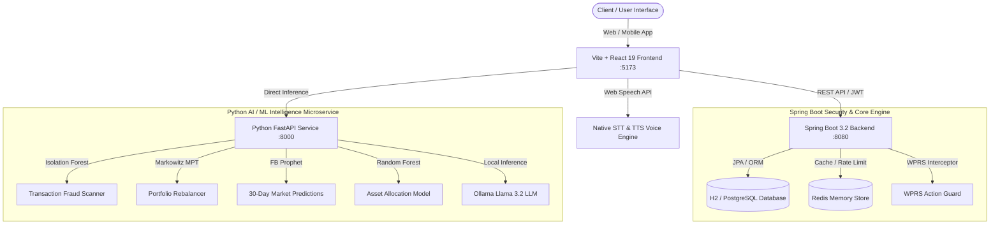

# 🛡️ SecureWealth AI — Next-Gen Algorithmic Wealth Twin & Security Shield

> **Prepared for Punjab & Sind Bank (PSB) Hackathon 2026**  
> *Combining Quantitative Risk Models, Modern Portfolio Theory (MPT), Real-Time Transaction Fraud Detection (WPRS), and Multi-Lingual Local LLM Reasoning.*

---

## 📌 Executive Summary

**SecureWealth AI** is a state-of-the-art digital wealth management platform designed to pair intelligent, AI-driven asset growth with an ultra-secure protection layer called the **Wealth Protection Rating System (WPRS)**. 

The platform constructs a real-time **Digital Wealth Twin** of the client's financial universe—integrating Account Aggregator data, physical assets, active SIPs/FDs, progressive tax planning, and market trends. Every high-value transaction or allocation shift is evaluated in real time by an unsupervised Isolation Forest anomaly scanner and deterministic behavioral guardrails.

---

## 🏛️ System Architecture & Data Flow



---

## ✨ Key Features & Technical Highlights

### 1. 🤖 Digital Wealth Twin & Circular Wealth Scoring
- **Circular Wealth Score (0–1000)**: Gamified overall financial health indicator evaluating four key vectors: Savings Rate (0-250), Milestone Goals (0-250), Investment Allocation (0-250), and Security Rating (0-250).
- **Categorized Health Status**: Maps scores dynamically to *Elite*, *Strong*, *Moderate*, *Weak*, or *Poor* ratings with actionable recommendations.

### 2. 🛡️ WPRS Real-Time Transaction Shield (Fraud Detection)
- **Deterministic & Unsupervised ML Guardrails**: Combines Isolation Forest anomaly models with behavioral biometrics (login hour, typing speed, transaction velocity, geographic distance from home, and recognized device fingerprints).
- **Automated Decision Engine**:
  - **`ALLOW` (Score < 30)**: Normal transaction parameters. Immediate clearance.
  - **`WARN` (Score 30–60)**: Moderate anomaly. Triggers biometric Step-Up OTP challenge modal.
  - **`BLOCK` (Score > 60)**: High-risk anomaly (e.g. 3 AM foreign wire transfer from new device). Intercepted at HTTP level before reaching controller.

### 3. 📈 MPT Rebalancer & Monte Carlo Simulator
- **Markowitz Mean-Variance Optimization (MPT)**: Computes the efficient frontier using SciPy optimizers. Maps client risk tolerance (1-10) to target asset weights across Equity, Debt/Bonds, Gold, and Liquid Cash.
- **Monte Carlo What-If Sandbox**: Simulates deterministic compounding pathways projecting P10 (Conservative), P50 (Expected), and P90 (Aggressive) growth curves over 10, 20, and 30-year horizons.

### 4. 🔮 FB Prophet 30-Day Market Forecast & Tax Optimizer
- **FB Prophet Forecasting**: Predicts 30-day time-series trajectories for Stocks, Gold, and Inflation with 80% confidence bands.
- **Section 80C Tax Engine**: Side-by-side comparison of **Old vs. New Tax Regimes** aligned with Budget 2025/2026 guidelines, standard deductions, and Section 87A rebate rules.

### 5. 🎙️ Multi-Lingual Voice Chatbot (STT / TTS)
- **Web Speech API Integration**: Custom React hook (`useSpeech.js`) enabling hands-free voice interaction in English, Hindi, Punjabi, and Urdu.
- **Features**: Live speech-to-text transcript preview, pulsating microphone wave ring, auto read-aloud toggle, and per-message read-aloud buttons.

### 6. 🌐 Project-Wide 4-Language Localization (i18n & RTL)
- **Supported Languages**:
  - 🇬🇧 **English (`en`)**: Default fallback dictionary.
  - 🇮🇳 **Hindi (`hi`)**: Devanagari script for Northern Indian banking users.
  - 🇮🇳 **Punjabi (`pa`)**: Gurmukhi script for regional users.
  - 🇵🇰/🇮🇳 **Urdu (`ur`)**: Arabic/Nastaliq script with full **RTL (Right-to-Left)** page layout orientation.

### 7. 📱 Mobile Presentation Prototype
- **Dual-Viewport Engine**: Toggle between Desktop Dashboard and Mobile Presentation Bar.
- **5 Mobile Tabs**: Home, Portfolio, Security, AI Twin, and Assistant. Includes quick investment execution, OTP challenge modals, and fraud simulation buttons.

---

## 🛠️ Technology Stack & Dependencies

### Frontend (`/frontend`)
- **Core**: React 19, Vite 6, React Router 7
- **Animations & Icons**: Framer Motion, Lucide React
- **Voice & Speech**: Web Speech API (`SpeechRecognition` & `SpeechSynthesis`)
- **Styling**: Pure CSS with Glassmorphism, CSS Grid, custom variables, and Google Fonts (`Outfit` & `Inter`)

### Backend Microservice (`/backend`)
- **Core**: Spring Boot 3.2.4 (Java 17)
- **Persistence**: JPA / Hibernate, H2 In-Memory DB (or PostgreSQL)
- **Security**: Spring Security + Stateless JWT Token Filter (`JwtAuthFilter`)
- **Caching & Interceptors**: Redis (with in-memory graceful fallback) & WPRS Interceptor

### Machine Learning Service (`/ml-service`)
- **Framework**: Python 3.10+, FastAPI, Uvicorn
- **ML & Data Science**: Scikit-Learn (Isolation Forest, Random Forest), Facebook Prophet, Pandas, NumPy, SciPy
- **Local LLM Narration**: Ollama (`llama3.2:3b`)

---

## 📁 Repository Directory Layout

```
Secure_Wealth_AI/
├── CONTEXT.md                    # Core architecture specifications & endpoints
├── README.md                     # Comprehensive project documentation
├── backend/                      # Java Spring Boot Backend Service (:8080)
│   ├── pom.xml
│   └── src/main/java/com/securewealth/
│       ├── controller/           # REST Endpoints (Auth, Dashboard, Portfolio, Goals, Security, Chat)
│       ├── interceptor/          # WPRS Action Security Interceptor
│       ├── model/                # JPA Entities (User, Portfolio, Asset, Goal, SecurityEvent, etc.)
│       ├── repository/           # Spring Data Repositories
│       └── service/              # Business Logic & Mock Account Aggregator Clients
├── frontend/                     # Vite + React 19 Single Page Application (:5173)
│   ├── package.json
│   ├── src/
│   │   ├── components/           # Navbar, Footer, Hero, Services, LanguageSelector
│   │   ├── context/              # AuthContext & LanguageContext (i18n & RTL)
│   │   ├── hooks/                # useSpeech custom Web Speech hook
│   │   ├── locales/              # Translation dictionaries (en.json, hi.json, pa.json, ur.json)
│   │   ├── pages/
│   │   │   ├── Dashboard.jsx     # Client Workspace with Sidebar & Modules
│   │   │   ├── MobileApp.jsx     # Dual-Viewport Mobile Prototype
│   │   │   └── modules/          # Overview, Portfolio, Goals, AIAdvisor, Security, Chatbot
│   │   └── services/             # Axios API client wrapper
└── ml-service/                   # Python FastAPI Machine Learning Service (:8000)
    ├── main.py                   # FastAPI routing entry point
    ├── requirements.txt
    └── models/                   # Pre-trained ML artifacts (.pkl / .joblib)
```

---

## ⚡ Getting Started & Quick Start Guide

### Prerequisites
- **Node.js**: v18+ and `npm`
- **Java JDK**: 17 or higher
- **Maven**: 3.8+
- **Python**: 3.10+ (for ML service)

---

### Step 1: Start Python ML Microservice (Port 8000)
```bash
cd ml-service
python -m venv venv
# On Windows:
.\venv\Scripts\activate
# On Linux/macOS:
source venv/bin/activate

pip install -r requirements.txt
uvicorn main:app --reload --port 8000
```
> *API docs available at `http://localhost:8000/docs`*

---

### Step 2: Start Spring Boot Backend Service (Port 8080)
```bash
cd backend
mvn spring-boot:run
```
> *Backend REST API running at `http://localhost:8080`*  
> *H2 Database Console available at `http://localhost:8080/h2-console`*

---

### Step 3: Start Vite Frontend Application (Port 5173)
```bash
cd frontend
npm install
npm run dev
```
> *Open `http://localhost:5173` in Google Chrome, Microsoft Edge, or Safari.*

---

## 🔑 Key API Endpoints Reference

### Spring Boot Backend (`http://localhost:8080`)
| Route | Method | Access | Description |
| :--- | :--- | :--- | :--- |
| `/api/auth/register` | `POST` | Public | Register client account & initialize default portfolio |
| `/api/auth/login` | `POST` | Public | Authenticate user credentials & issue JWT token |
| `/api/dashboard/summary` | `GET` | Protected | Fetch net worth, income, savings rate, and recent transactions |
| `/api/portfolio/` | `GET` | Protected | Get complete portfolio breakdown (investments & tangible assets) |
| `/api/goals` | `GET / POST` | Protected | Retrieve or create financial milestone targets |
| `/api/goals/{id}/projection` | `GET` | Protected | Calculate compounding goal trajectory |
| `/api/security/wprs` | `GET` | Protected | Get real-time WPRS score and security audit events |
| `/api/security/devices` | `GET` | Protected | List registered hardware device fingerprints |
| `/api/chat/message` | `POST` | Protected | Process chat query through Ollama hybrid LLM bridge |

### Python FastAPI ML Service (`http://localhost:8000`)
| Route | Method | Description |
| :--- | :--- | :--- |
| `/api/detect-fraud` | `POST` | Isolation Forest transaction anomaly scanner |
| `/api/rebalance-portfolio` | `POST` | Markowitz Mean-Variance Optimization portfolio rebalancer |
| `/api/market-forecast/{series}` | `GET` | FB Prophet 30-day market predictions (`stocks`, `gold`, `inflation`) |
| `/api/tax-saving` | `POST` | Section 80C Old vs New regime solver |
| `/api/session-risk` | `POST` | Behavioral biometrics & session risk calculator |

---

## 🏆 Hackathon Demo Scenarios

1. **Multi-Lingual & RTL Switch**: Click the language dropdown in the top navbar to toggle between **English**, **Hindi**, **Punjabi**, and **Urdu**. Notice how Urdu automatically switches layout direction to Right-to-Left (`dir="rtl"`).
2. **Voice Chat Demo**: Navigate to the **AI Chatbot** tab. Click the microphone icon to speak a query in your chosen language. Listen to the AI speak its answer back using native Text-to-Speech.
3. **WPRS Fraud Interception**: Go to the **Security Twin** tab or Mobile view. Enter a transaction of ₹2,50,000 from an unrecognized location at 3 AM. Observe how WPRS flags the threat and triggers a Step-Up OTP challenge.
4. **Markowitz Portfolio Optimizer**: Navigate to **AI Advisor**. Adjust the Risk Appetite slider (1-10) to watch the MPT rebalancer recalculate target weights across Equity, Bonds, and Gold.

---

## 📜 License & Acknowledgments

Developed for the **Punjab & Sind Bank (PSB) Hackathon 2026**.  
*All financial models, market simulations, and behavioral security algorithms are designed for educational and demonstration purposes.*
